## Data Preparation with Data Refinery

In this hands-on exercise you will work through similar steps as in the _Titanic Data Preparation_ notebook. You will learn how to use  _Data Refinery_ to cleanse and shape data with a graphical flow editor.

Make sure to consult the referenced (see related links at the end of this page) throughout the tutorial to gain a deeper understanding of the underlying concepts. 

## Prerequisites
- Kaggle Titanic data set (here: `train.csv`) available as _data asset_ in Watson Studio
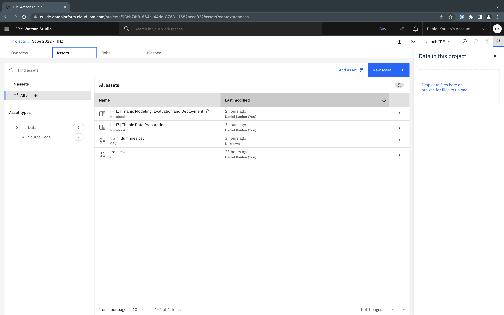

## Getting Started
In your _Watson Studio_ project 
- open the context menu of the data asset and select _Refine_
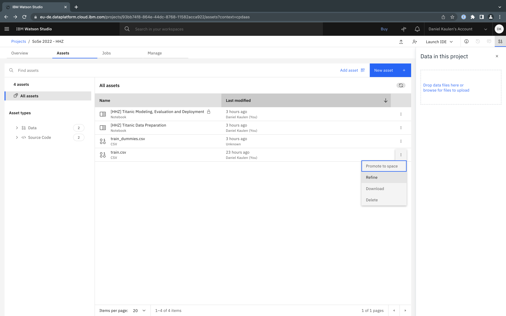
- you will see a preview of the data set
  - while loading, only the first 50 rows are shown:
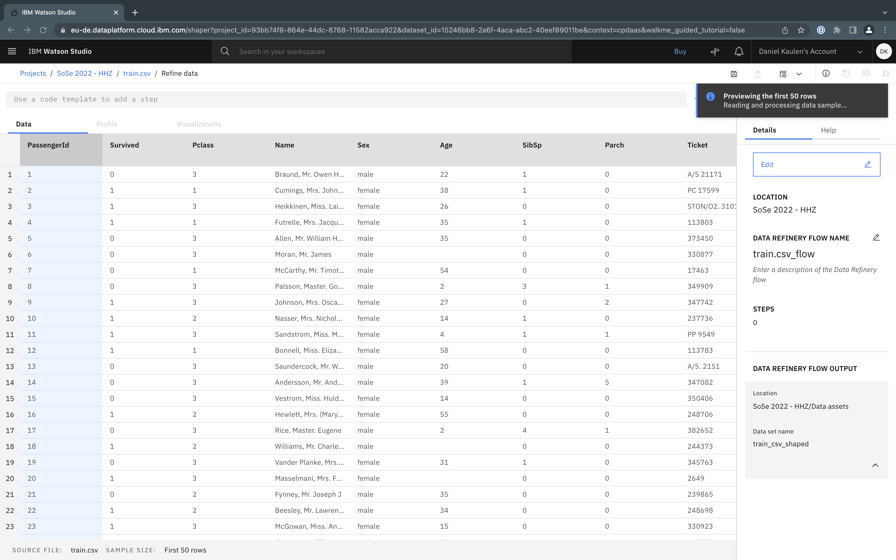
  - depending on the size of your dataset you may not operate on the full data set, check the details in the bottom once loading completed for details. The titanic data set only has 891 rows and you can operate on the full data set with Data Refinery:
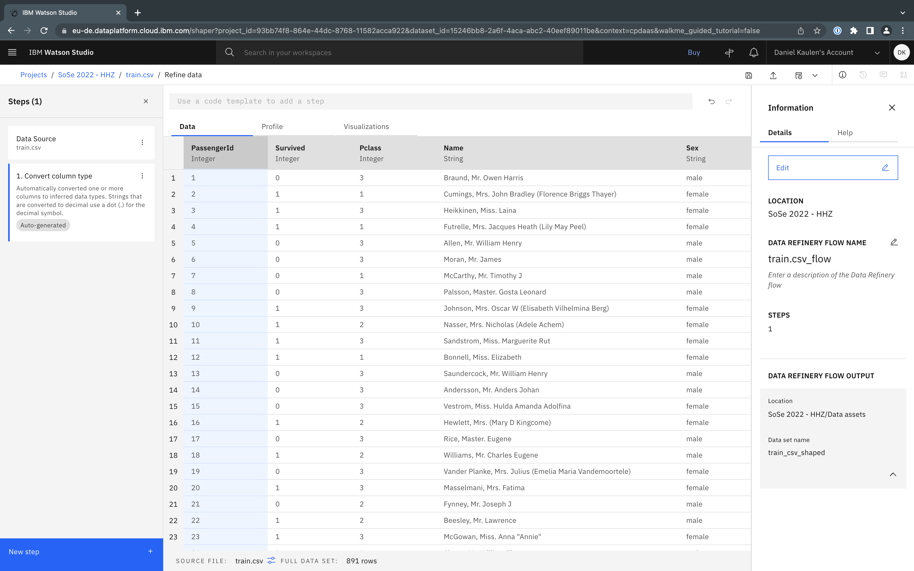
  - on other (bigger) data sets you may only operate on a sample set of the data (current limit: 10.000), see status bar or documentation for details: 

Use the 
  - _Data_ tab to cleanse and shape the data
  - _Profile_ tab to validate and find anomalies in the data
  - _Visualizations_ tab to get insights into the data 
- Note that the individual data transformation steps applied to the source data set are listed on the left hand side

## Prepare Data with Data Refinery

Use Data Refinery to explore and prepare the data as you previously did in the `Titanic Data Preparation` notebook. See related links for inspiration or check out the screenshot below that illustrates how split the "Name" column into "Last name", "Title", "First name" and remove rows with duplicated passenger ids.
- 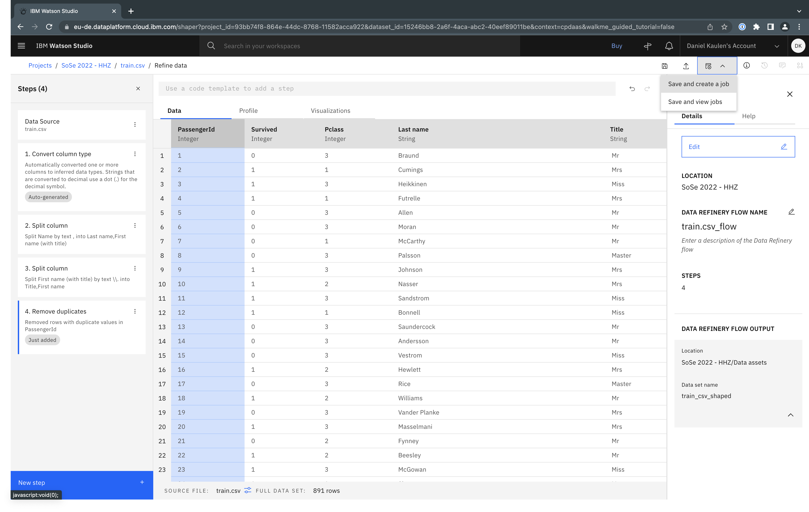

 Once you're done, you can create a job that runs the transformation steps on the entire data set and store the resulting file as a project asset that you can process further (e.g. with Python in a notebook):
- Select _Save and create a job_
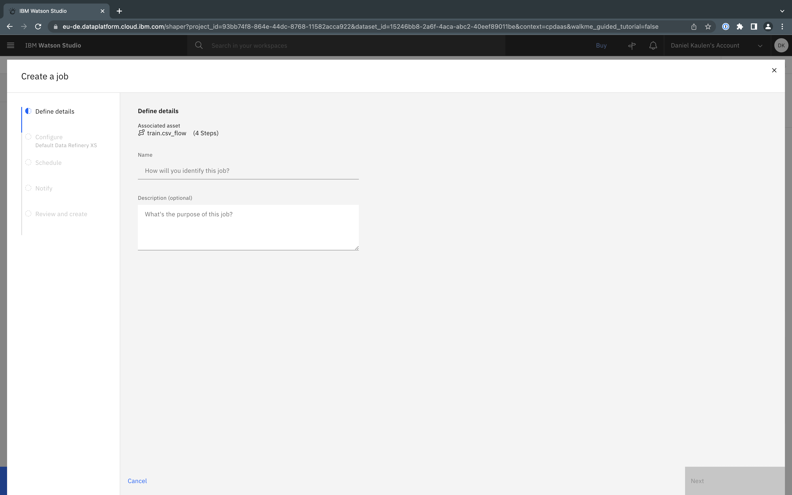
- Configure the job (do not set a schedule, for the purpose of this exercise this job only needs to be run once)

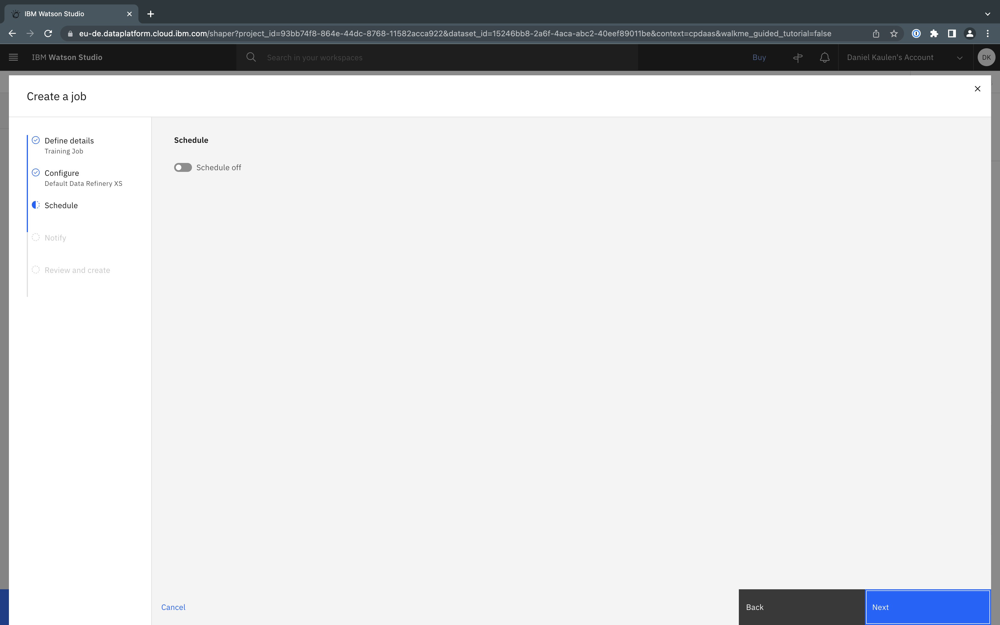

- Select _Create and run_
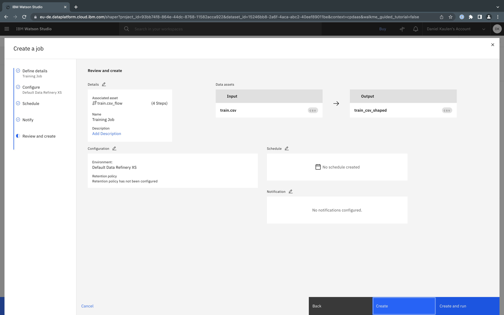
- On the job overview page click on the job run to review its details
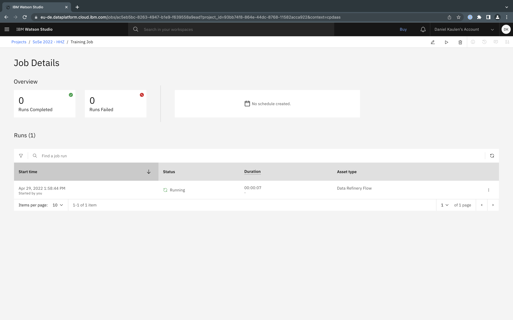
- Once done, the job status will be "Completed" (refresh the page to get the most recent status)
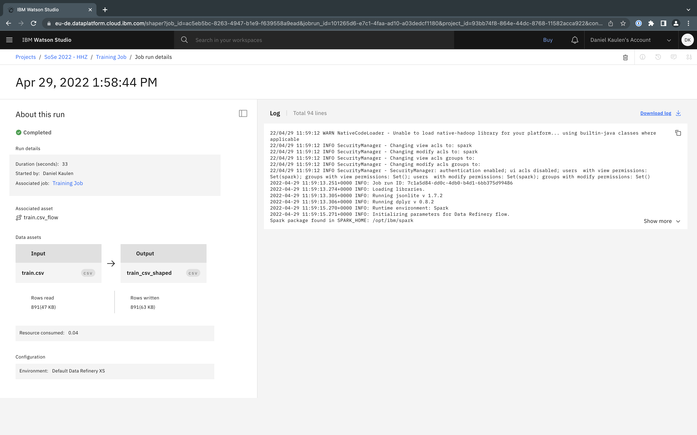
- On the project assets tab, you will find the generated output and can download it, or review the result 
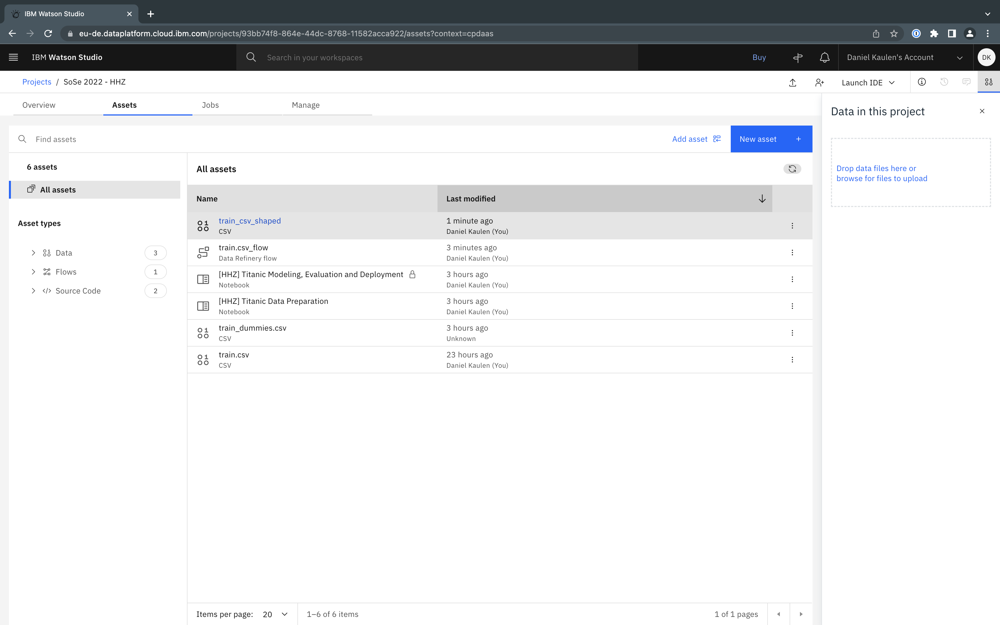
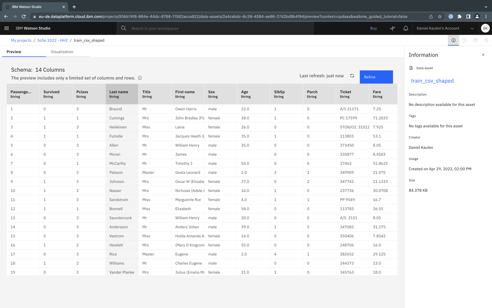

## Related Links
- [Tutorial - Replace missing values and remove duplicates in Titanic data set (see Step 6, 7)](https://developer.ibm.com/tutorials/data-preparation-with-ibm-data-refinery/)
- [Tutorial - Shape raw data](https://dataplatform.cloud.ibm.com/docs/content/wsj/refinery/dr_tutorial.html?audience=wdp)
- [Documentation - Data Refinery](https://dataplatform.cloud.ibm.com/docs/content/wsj/refinery/refining_data.html)
