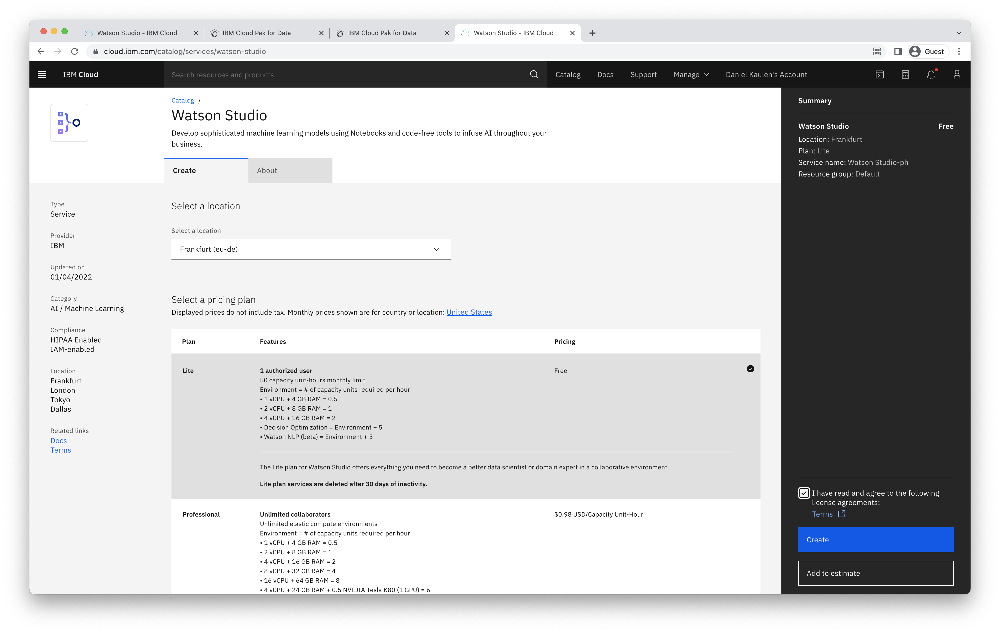
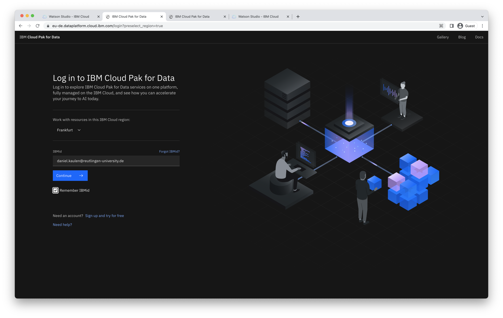
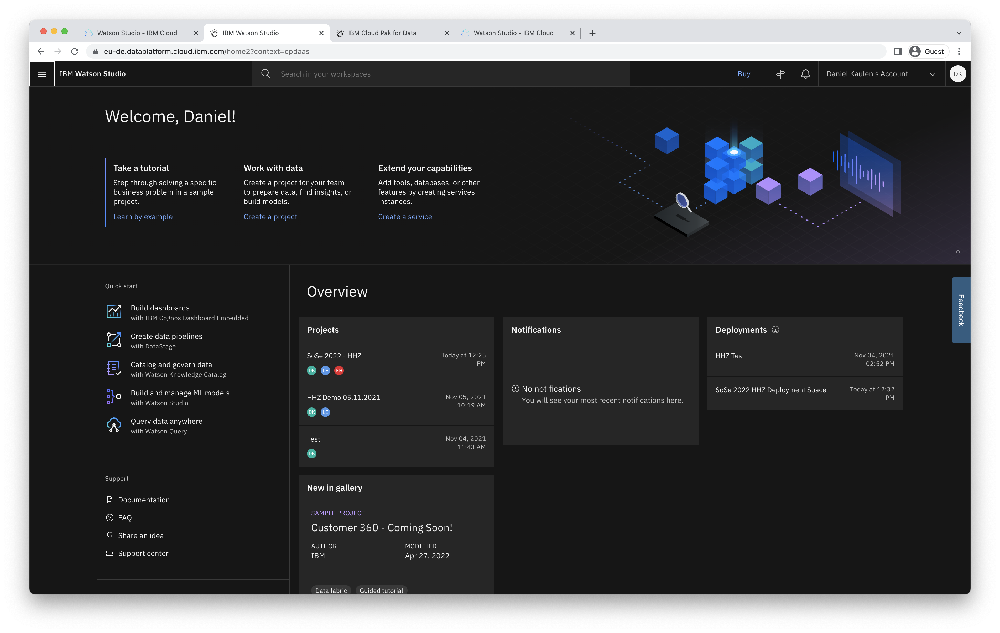

## How can I access Watson Studio?

## First Time Setup
1. Setup your IBM Cloud account with the Academic Initiative ([documentation](../request-promocode))
2. Log in to https://cloud.ibm.com/
3. Create a free Watson Studio service instance hosted in Frankfurt via https://cloud.ibm.com/catalog/services/watson-studio

## Login
Log in with your existing IBMid on https://dataplatform.cloud.ibm.com/ to access Watson Studio.

## General troubleshooting advice
- clear cookies and/or use incognito browser mode