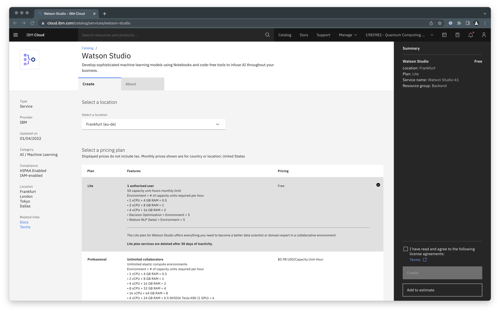
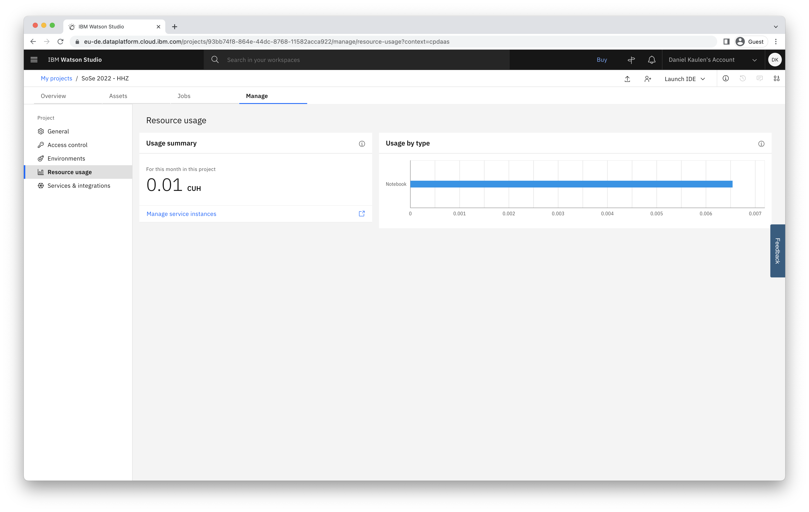

# How long can I use Watson Studio for free?

- With a free "Lite" plan, you will get free access to a limited amount of capacity-unit hours.

- You can access a resource usage summary for your project via the "Manage" tab under "Resource Usage"

### Related Links
- [Documentation - Runtime usage](https://dataplatform.cloud.ibm.com/docs/content/wsj/analyze-data/track-runtime-usage.html)
