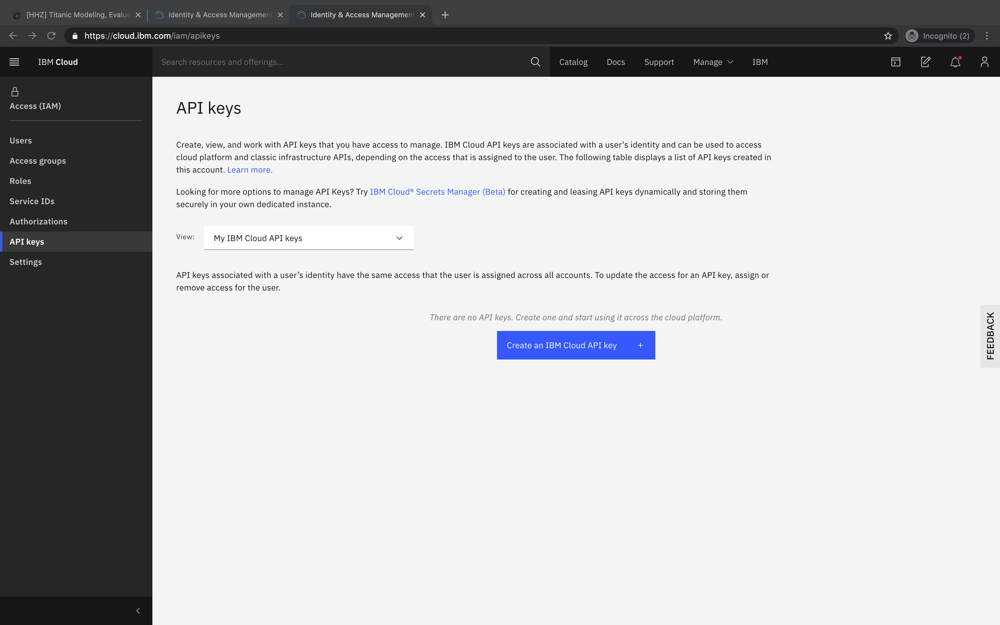
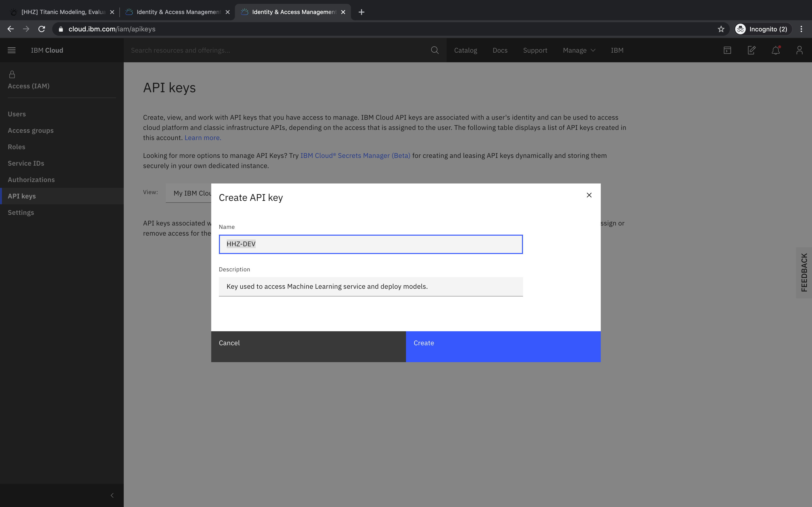
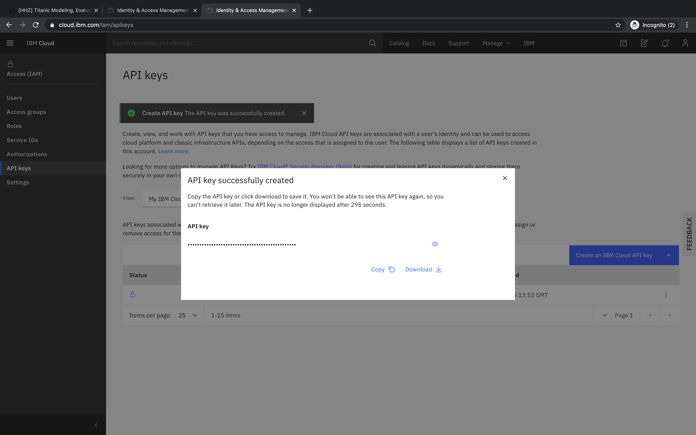

## How can I create an IBM Cloud API key?

- Open https://cloud.ibm.com/iam/apikeys and select _Create an IBM Cloud API key_

- Enter name and description, click _Create_

- Copy or download your key for future reference

For more fine-grained access control, you can also create service specific API keys via https://cloud.ibm.com/iam/serviceids. Details are beyond the scope of this course / document.
