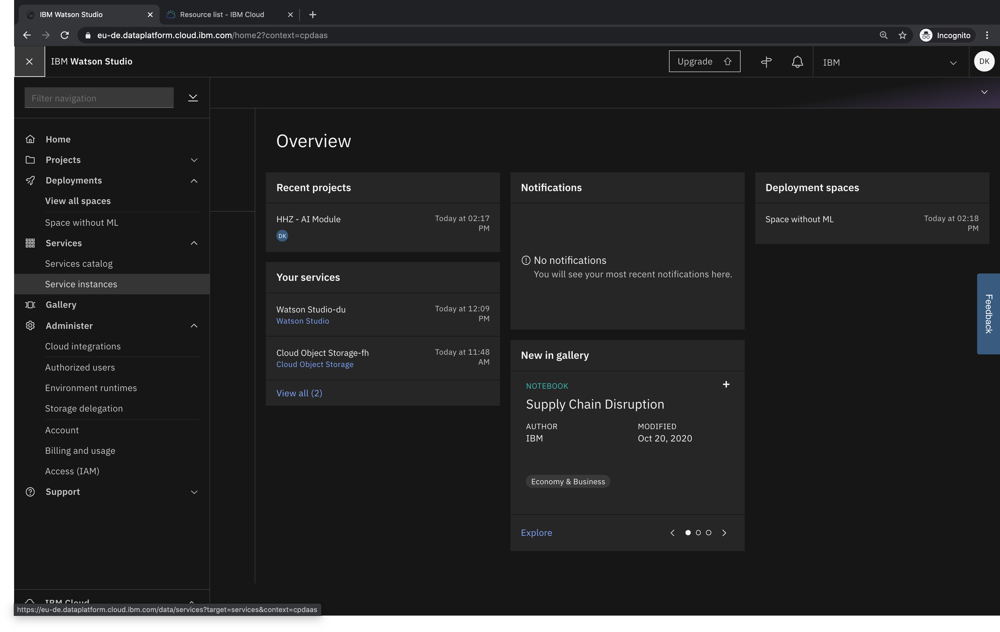
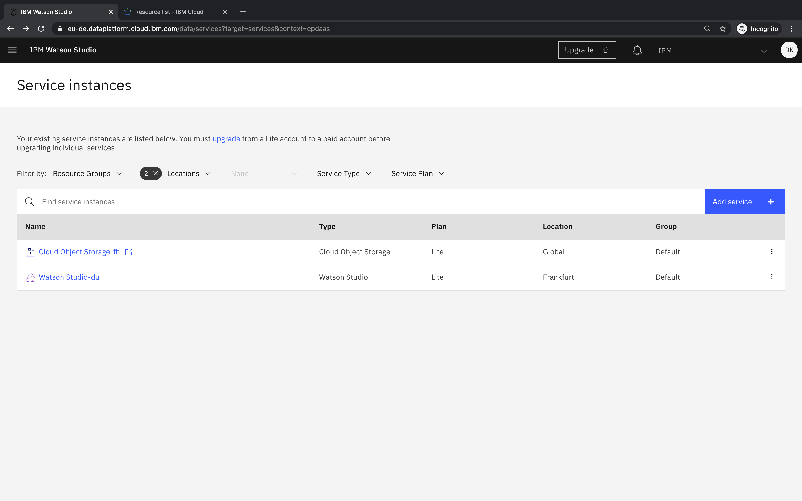
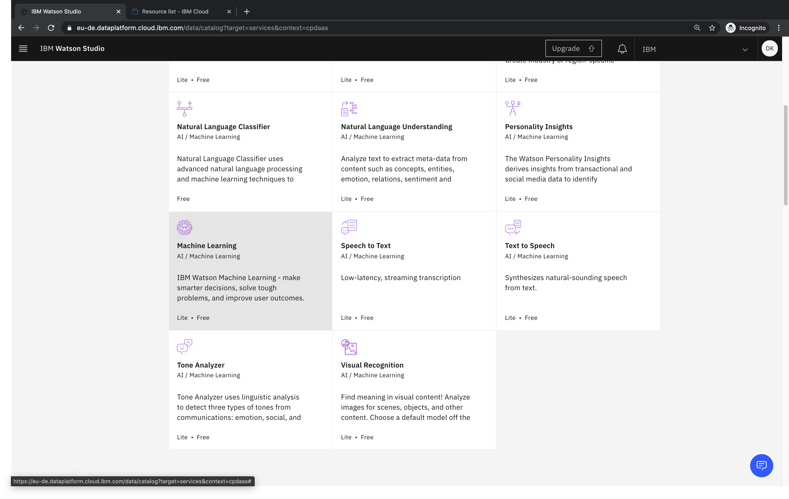
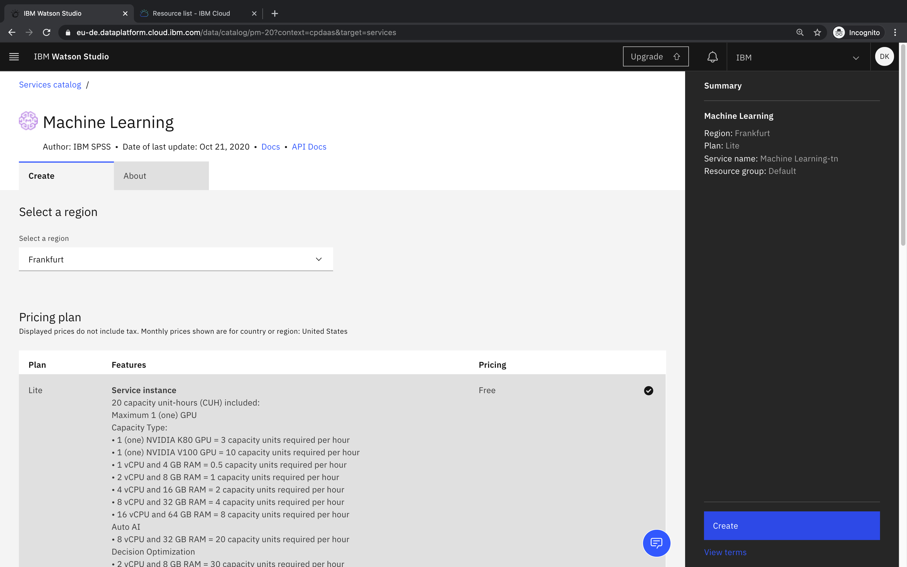

## How can I create a Watson Machine Learning service?

- Select _Service instances_ in the menu

- Select _Add service_

- Select _Machine Learning_

- Create a free lite version instance

### Related links
- [Documentation - Machine Learning](https://dataplatform.cloud.ibm.com/docs/content/wsj/analyze-data/ml-overview.html)
