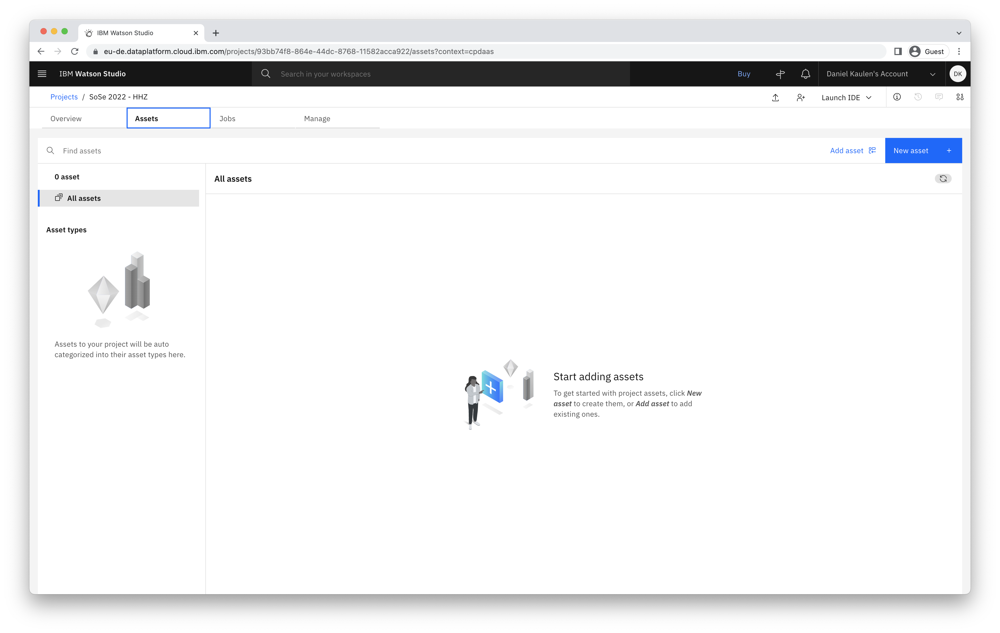
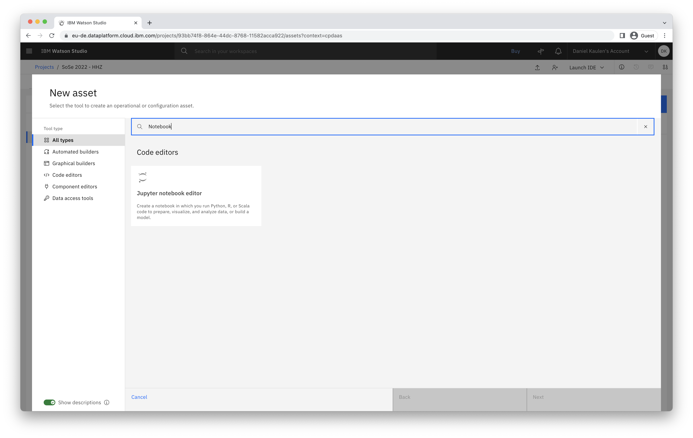
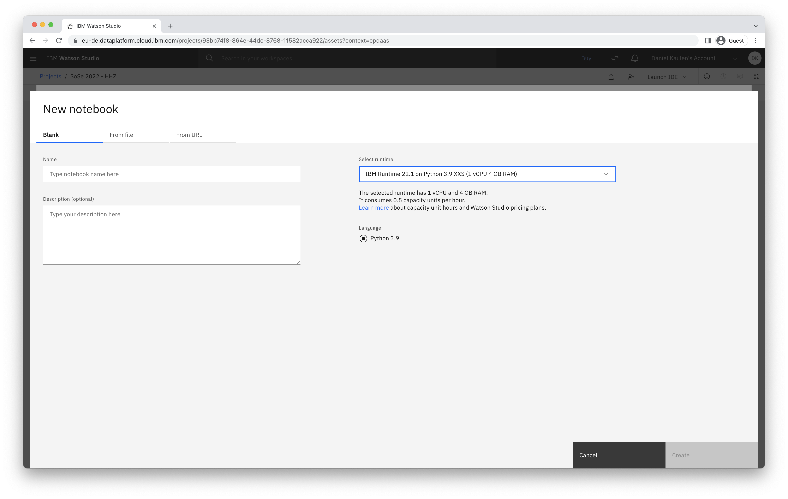
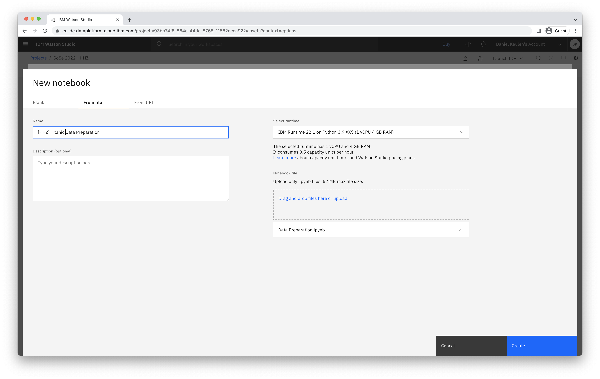
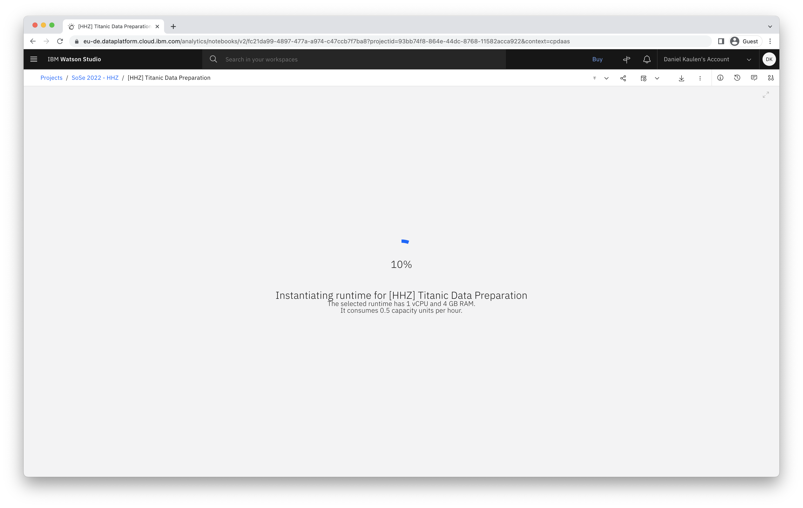
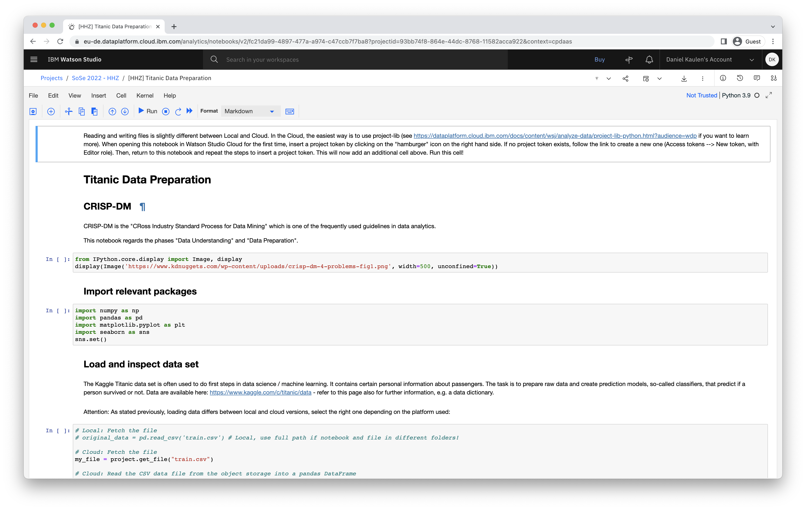

## How can I create a new notebook?

- Access your project
- Click _New asset_ in the navigation bar

- Choose _Jupyter notebook editor_ as asset type

- You can choose to create a new empty notebook, or create a notebook from an existing file or URL. The shown runtime with 1vCPU and 4GB RAM offers enough resources to work through the exercises (choose the latest available version).

- Click _Create_ to create the notebook and instantiate the selected runtime

- Once the runtime is started, you are able to edit and execute cells of the notebook

### Related Links
- [Documentation - Creating notebooks](https://dataplatform.cloud.ibm.com/docs/content/wsj/analyze-data/creating-notebooks.html)
- [Project Jupyter](https://jupyter.org/)
