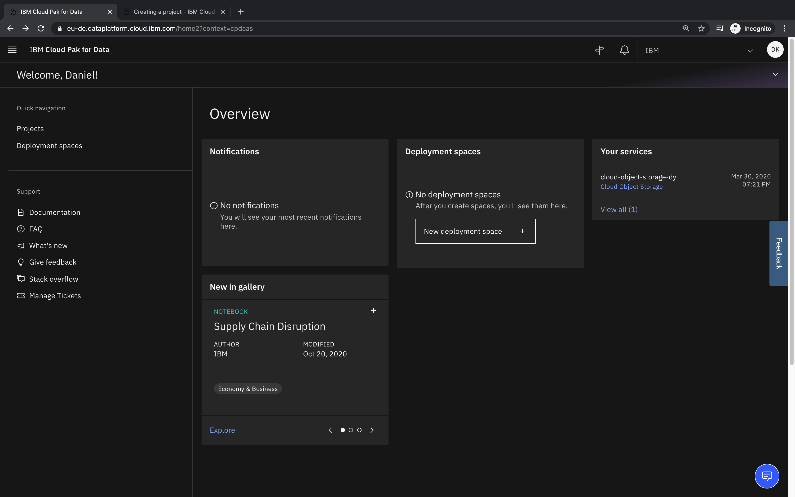
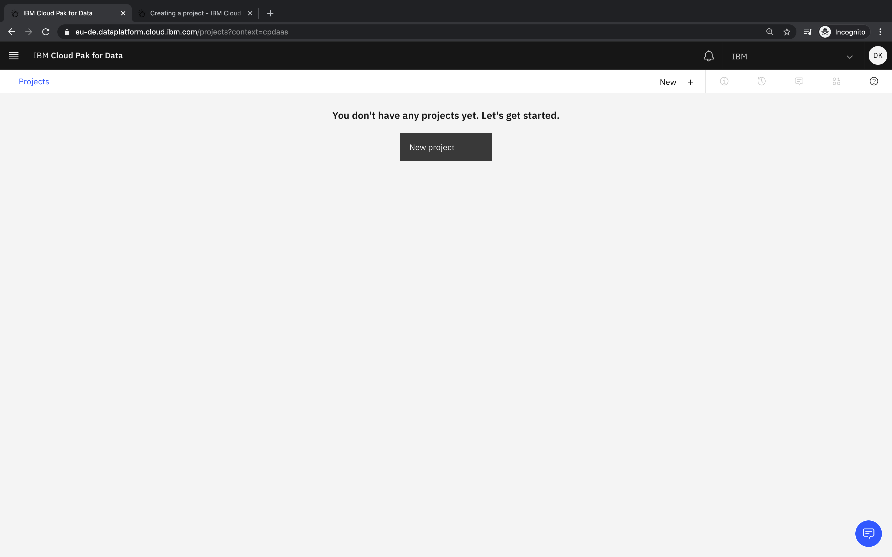
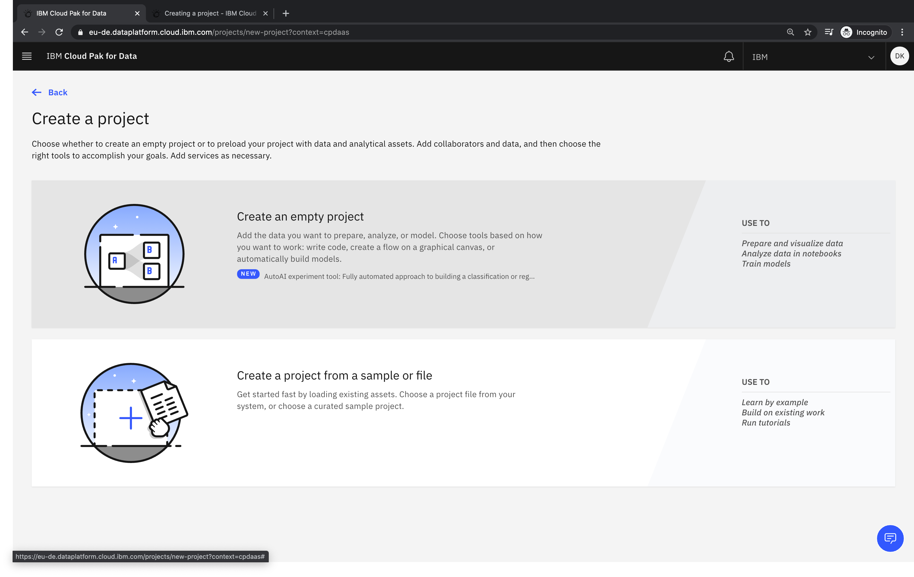
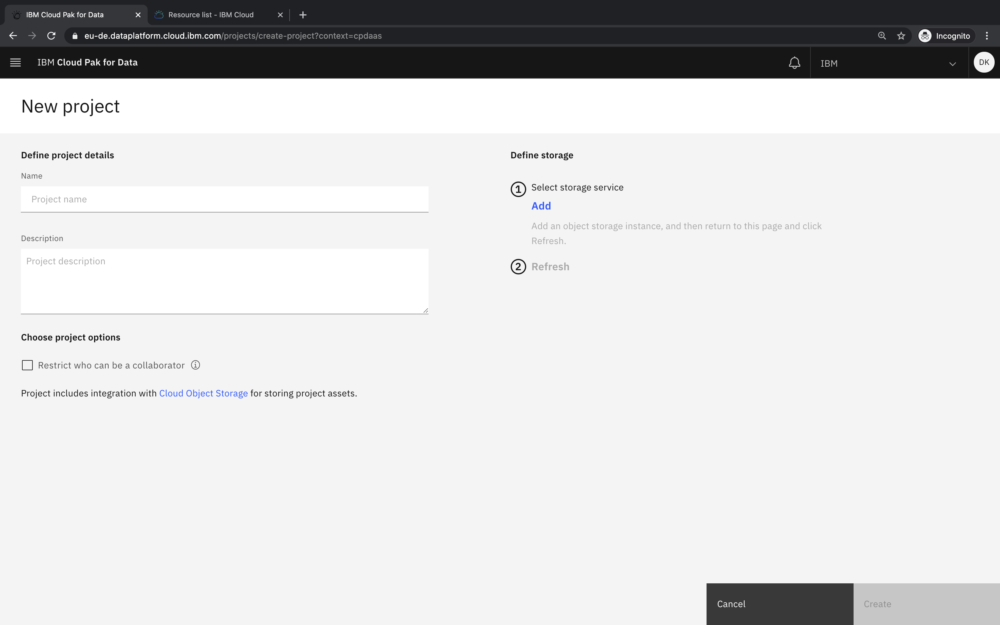
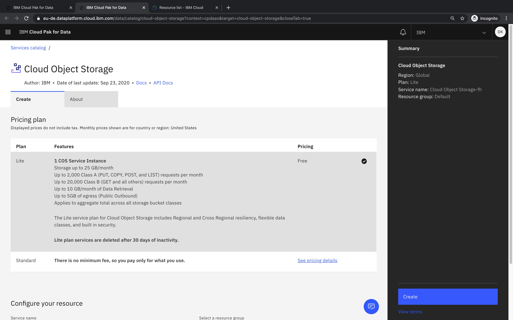
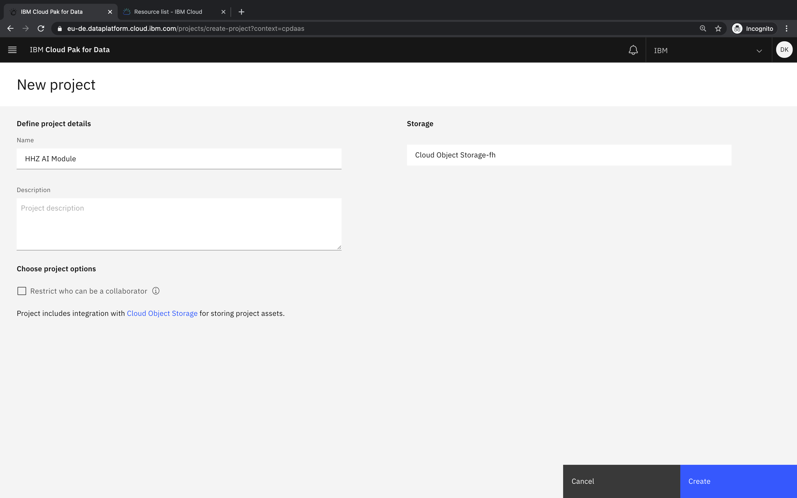
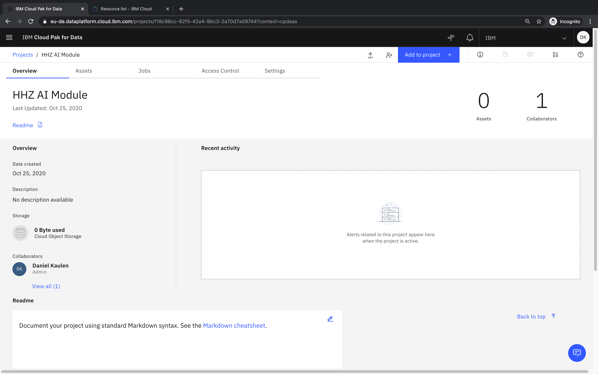

## How can I create a new project?
- Log in to your account
- Select _Projects_

- Select _New project_

- Select _Create an empty project_

- (optional) If you see the _Define storage_ section on the right, click _Add_ to link your project with a storage instance

- (optional) Create a new Cloud Object Storage instance

- Specify project name / description and click _Create_

- You will be redirected to your project

### Related Links
- [Documentation - Projects](https://dataplatform.cloud.ibm.com/docs/content/wsj/manage-data/manage-projects.html)
- [Documentation - Creating a project](https://dataplatform.cloud.ibm.com/docs/content/wsj/getting-started/projects.html)
