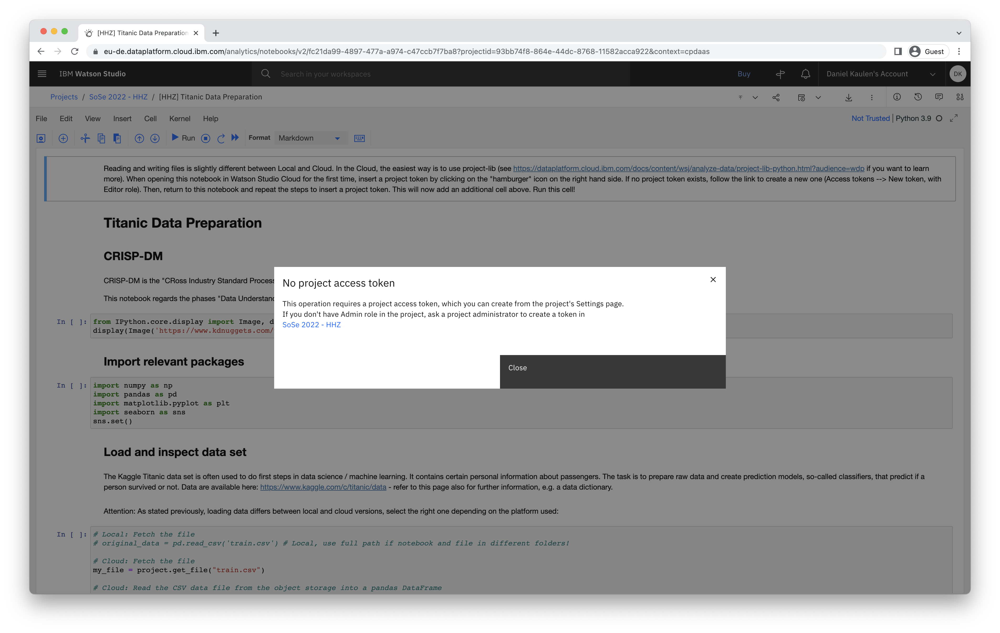
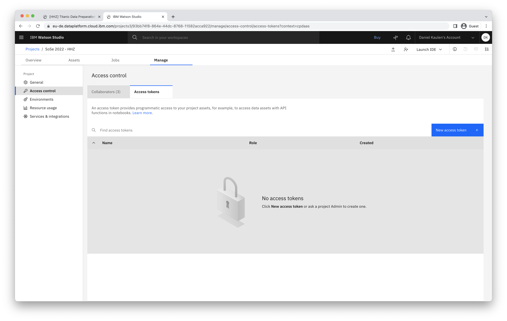
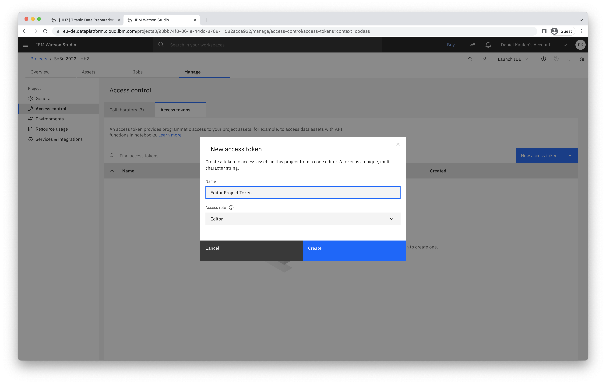
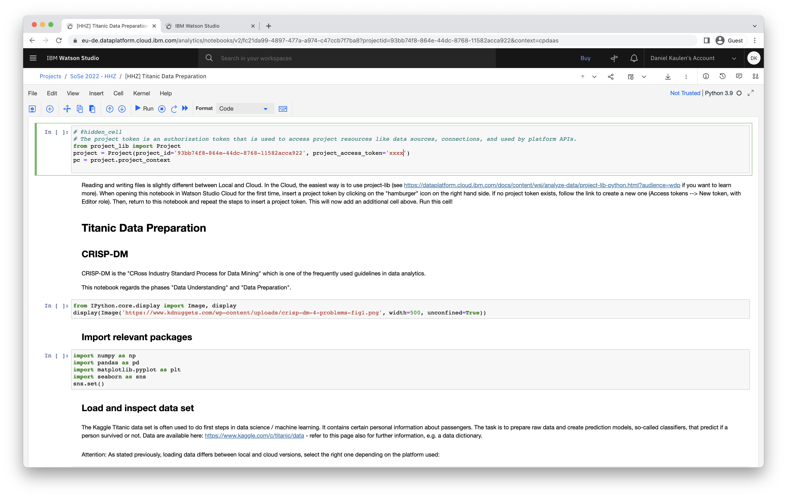

## How can I add a project token to my notebook?

- Open your notebook in edit mode
- Click on the three vertical dots and select insert project token

- If no project token is set, follow the link to create a new project access token

- Enter token details in the modal dialog (select Editor rights to ensure you can create and read files in your project)

- Go back to your project, and select "Insert project token" again

- Run the first cell that was inserted to your notebook

### Related links
- [Documentation - Manually ading the project token](https://dataplatform.cloud.ibm.com/docs/content/wsj/analyze-data/token.html)
- [Documentation - Using project-lib for Python](https://dataplatform.cloud.ibm.com/docs/content/wsj/analyze-data/project-lib-python.html)
