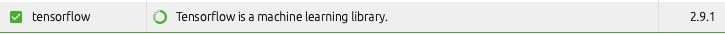
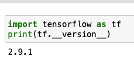
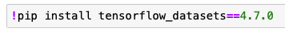
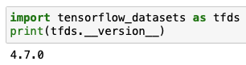

# How can I install Tensorflow locally?

### Prerequisite:
- Conda environment set up and able to run notebooks locally (see [guideline](../run-jupyter-notebooks-locally))

### Steps


At the time of writing, the most recent version of `tensorflow-datasets` that is compatible with Python 3.9 has not yet been published to the default Conda channel. We therefore install this package via [pip](https://pypi.org/project/pip/) directly.

1. Install the latest version of tensorflow using Conda in the Anaconda navigator (2.9.1)


2. Open your notebook and check the installed versions (if any)
You may need to restart your kernel if it was already running.
```
import tensorflow as tf
print(tf.__version__)
```


3. Update or install `tensorflow-datasets` via the commands from within your notebook as needed:
```
!pip install tensorflow_datasets==4.7.0
```



```
import tensorflow_datasets as tfds
print(tfds.__version__)
```



4. Restart your Kernel via (Kernel > Restart) and check if the installation succeeded 

