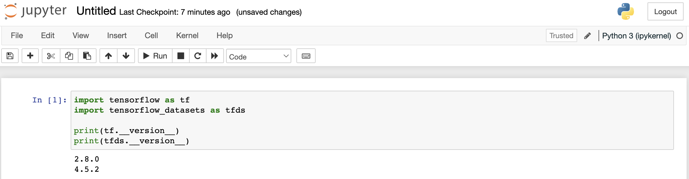

# How can I install Tensorflow locally?

### Prerequisite:
- Conda environment set up and able to run notebooks locally (see [guideline](../run-jupyter-notebooks-locally))

### Steps
At the time of writing, the most recent versions of `tensorflow` and `tensorflow-datasets` have not been published to the default Conda channel. We therefore install them via [pip](https://pypi.org/project/pip/) directly.

1. Open your notebook and check the installed versions (if any)
```
import tensorflow as tf
import tensorflow_datasets as tfds

print(tf.__version__)
print(tfds.__version__)
```


2. Update or install `tensorflow` and `tensorflow-datasets` via the commands below as needed:
```
pip install tensorflow_datasets==4.5.2
pip install tensorflow==2.8.0
```

3. Restart your Kernel via (Kernel > Restart) and check if the installation succeeded (via step 1)

