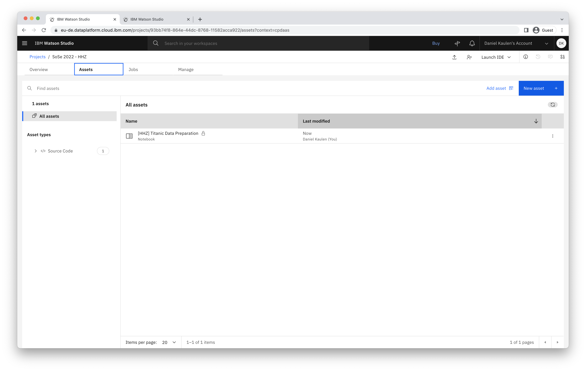
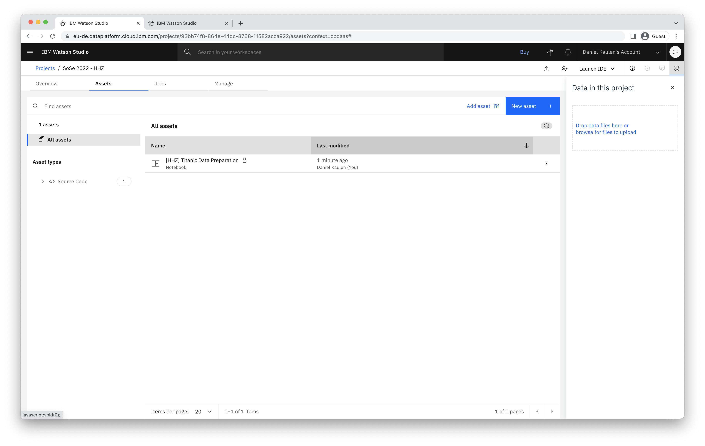
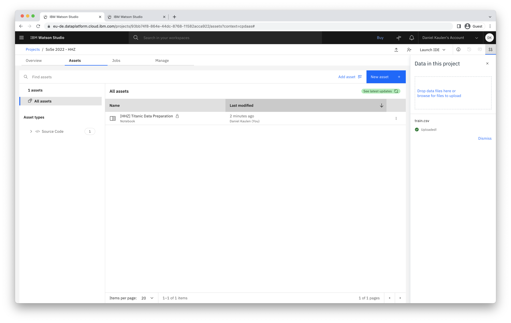

# How can I upload data files to my project?

The approach described below is suitable for adding data files (e.g. .csv, .xlsx) to your project. Notebook assets (.ipynb) must be created via a dedicated UI because it requires to specify additional metadata during the creation.   

- Access your project

- Open the navigatino menu on the right

- Upload your file(s) and click "See latest updates" to refresh the asset section

### Related links
- [Documentation - Adding data to a project](https://dataplatform.cloud.ibm.com/docs/content/wsj/manage-data/add-data-project.html)
